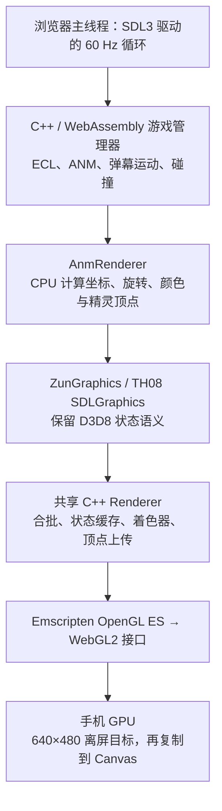

# 永夜抄 3.2.1：移动端弹幕性能与执行路径核查

核查日期：2026-09-14。公网、8088 及采样使用相同发布版：

`158c4d7b4f001c80fb429e3d7073dbbb69853a8beda722e1ff2f462f162f5ec2`

本次增加性能采样工具和报告，没有修改或重新部署游戏核心。不能将这次诊断理解为手机卡顿已经修复。

## 当前执行与渲染路径

SDL3 提供 GL 上下文、窗口、输入及平台服务。当前并未使用 SDL_Renderer 或 SDL_GPU API 完成游戏绘制；OpenGL ES / WebGL2 绘制由自研 Renderer 负责。

- 原版 x86 指令执行、原地址 JIT 分发：发布核心未使用。`TH_NATIVE_PLATFORM` 编译分支使用具名 C++ 调用，旧编号设备 ABI 留在未启用的 Legacy 分支。
- ECL / ANM 指令分发：仍有，它们是原游戏资源脚本的执行器，不是原 EXE 的 CPU 指令模拟。
- 图形兼容：仍有，深度、雾、混合、纹理参数及坐标规则保留 D3D8 语义，再转换成 WebGL2。
- 数值兼容：仍有 `Extended`、快速兼容计算和 SoftFloat 回退，维持舍入、角度、碰撞和录像行为。并非所有运算都是普通硬件 float。
- 游戏更新、顶点生成和图形提交：仍在同一浏览器主线程，无游戏 Worker、OffscreenCanvas 渲染线程或 pthread 并行构建。

代码入口：`cpp/sdl/GameHost.cpp:39`、`cpp/platform/BrowserRuntime.cpp:124`、`cpp/game/AnmRenderer.cpp:49`、`cpp/sdl/GraphicsHost.cpp:17`、`../../portable/sdl/Renderer.cpp:94`。

## 实际合批与成本

TH08 已将相邻兼容状态的精灵合批。不是每颗弹幕一次 WebGL draw call。CPU 先计算四个精灵角点，展开为六个顶点；共享 Renderer 再复制到自己的提交缓冲并上传 GPU。每颗普通精灵六个顶点约 168 字节，不含前面的结构和复制成本。

共享渲染器的实例化路径目前限定 `version==10 && fvf==0x102`，TH08 弹幕没有进入该路径。它依赖 CPU 几何计算与普通批次，GPU 负责后续栅格化、贴图和混合。

`PlayerCollision::barrier` 等碰撞路径会逐弹检查消弹区域，并计算包围盒、旋转或圆形判定；这些路径也调用精度兼容运算。合批并不能免去这些 CPU 工作。

## 采样结果及边界

工具：`portable/profile-th08-density.mjs`；原始文件：`artifacts/density-profile`。

使用发布 Wasm 和它对应的链接符号表，Chromium 移动视口、Intel UHD Graphics 730 / ANGLE D3D11。测了 Stage 1、Stage 2 Boss 与 Extra 原版录像区间。没有连接实体手机，Stage 2 区间不代表最密集弹幕或最坏情况。

Extra 的后续 1200 次更新 CPU 采样：

| 路径 | 活跃 CPU 采样占比 |
| --- | ---: |
| BulletFlow 更新回调（含关联物品、弹幕与激光） | 32.4% |
| BulletFlow 绘制回调（含关联物品、弹幕与效果） | 31.7% |
| 数值兼容函数，包括快速路径 | 41.9% |
| AnmRenderer / GraphicsMath 几何路径 | 50.0% |
| 已识别的 WebGL 提交函数 | 4.3% |

这是调用栈包含时间。数值与几何类别和上面的回调重叠，不能相加。优化构建内联了 GameApplication 的 update/draw，不能从该符号表精确拆出整个游戏的更新和绘制总时间。采样也不包含独立 GPU 进程、浏览器完整合成和正常 RAF 音频循环的全部成本。

Extra 前面两个各 600 帧的区间，平均每帧约 27–29 个 GPU 批次，约 123–128 KiB 顶点流上传。纹理常驻，读取 GPU 像素的字节数为零，只有个别帧更新少量纹理。桌面 GPU 查询均值约 0.77 / 1.22 ms；第二段开启四倍 CPU 节流，但 GPU 未模拟手机。两段推进了不同的录像区间，不构成同帧四倍性能对比。

本机未复现手机持续十几帧。CPU 热点为下一步优化提供了证据，但不能据此排除实体手机上的透明像素叠加、驱动、浏览器合成、温控或内存压力。

## 优先优化方向

1. 减少精灵顶点路径中反复的 Extended 构造、转换、运算与舍入；对可证明等价的常见条件使用更直接的计算，逐帧检查像素。
2. 对同一帧不变的消弹区域、包围盒和旋转参数进行预计算，保留判定顺序、原版边界和副作用，以录像和原版函数作对照。
3. 为 TH08 优化顶点流，减少六顶点展开后的重复复制；评估索引或实例化批次，保持透明绘制顺序。
4. 补充实体手机的帧时间与 GPU 采样。主线程拆分可以改善触控响应，但单纯移到 Worker 不会减少数学和碰撞总量。

这些方向保留原版弹幕、碰撞和更新频率，不以删弹或跳过游戏逻辑来换帧数。

## TH06 / TH07 参考渲染核查（2026-09-14）

核查本地参考源码：`th10_web/reference/eagler-th06` 的 `REFERENCE.json` 指向 YomotsuHisami/th06 的 eagler 分支归档 `645bd6a437b58f30f650716eb42a308e85756c02`；`th10_web/reference/eagler-th07` 为 YomotsuHisami/th07 的干净提交 `5f80a0df8a8434afd2544d4aaa95691ea4d65f89`。这些结论针对上述快照；不以启动器 README 的性能宣传代替实测。

两者当前 CMake 构建均选择 `src/graphics/Gles.cpp` 并链接 SDL3。TH06 的 GameWindow 直接调用 `GlesGraphics::Init`；TH07 的后端列表选择同名实现。网页游戏绘制使用 GLES / WebGL，不依赖 D3D8 运行库。TH06 的旧 D3D include、设备调用大多是注释，TH07 的 `g_TextureFormatD3D8Mapping` 名称也不是运行中的 D3D8 后端。

TH06 使用 `GfxInterface`，TH07 使用 `ZunGraphics`，后端都明确实现纹理、矩阵、混合、雾、顶点上传和 GL 绘制。纹理因子、预变换顶点、颜色混合等原作所需语义仍保留在自定义接口和 shader 中；不能把这些语义称为 D3D8 依赖。我们也没有加载 D3D8 运行库，但共享 Renderer 仍直接存储原 D3D8/9 状态编号、FVF 和格式编号，接口整理程度与参考实现不同。

参考实现同样在 CPU 生成精灵几何并批量提交。TH07 `AnmManager.cpp:1539` 的 Flush / PushSprite 把四个角点展开为六个顶点，旋转路径使用 f32 / sincosf。TH06 `AnmManager.cpp:1946` 也有精灵批次。因此，CPU 生成顶点或未使用弹幕实例化，本身不说明架构不适合手机。

发现一个应优先作移动设备 A/B 验证的上传差异：

- TH07 `src/graphics/Gles.cpp:1185`、TH06 对应文件 `:1288`：Web 分支每批通过 `glBufferData(..., vertexData, GL_STREAM_DRAW)` 替换缓冲存储，再绘制。原生分支仍使用分段 `glBufferSubData`。
- 两份源码注释记录：分段更新与绘制交替的旧方式在其测试的 Mali / Adreno 安卓设备上造成严重 CPU 提交瓶颈，替换存储改善了表现，桌面 Intel 的差异很小。这是参考项目的测试记录，本轮未在实体手机复验其性能结论。
- 我们的 `portable/sdl/Renderer.cpp:73` 每帧或容量不足时分配存储，每批用不同 offset 调用 `glBufferSubData`，仍属于上述旧更新模式。TH08 和 TH10 共用此实现。

这使缓冲上传方式成为比笼统的“D3D8 导致卡顿”更具体的候选原因。桌面 GPU 用时和 draw-call 数量不能排除安卓驱动在这个路径上的成本。本轮只核查并记录，未改动游戏渲染代码或公网版本；尚不能断言这是该玩家手机掉帧的唯一原因。
